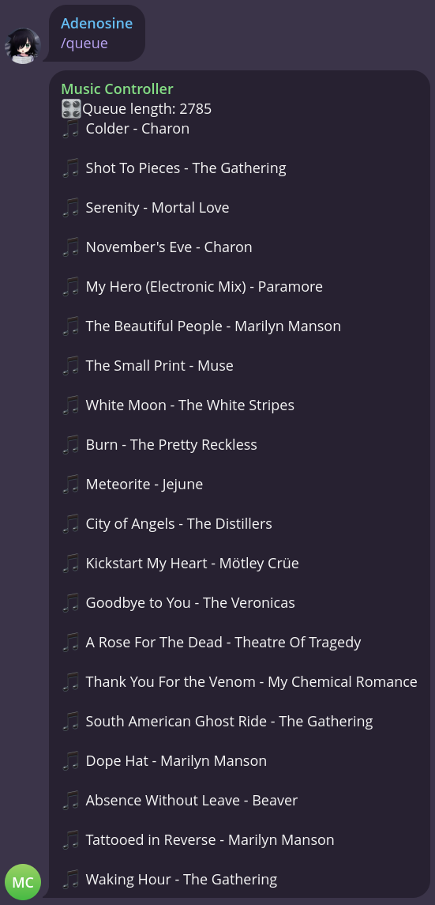
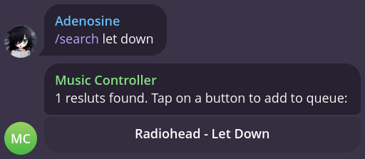
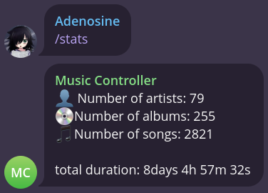

# tmpc

TMPC is a client for [mpd](https://www.musicpd.org/) in the form of a telegram bot,
built in rust with teloxide and mpd crates.
The name stands for Telegram Music Player Client.

## Features

tmpc supports all of those commands:

- start — Start the bot
- help — Show this help
- play — Play/Pause music
- next — Switch to next track
- prev — Switch to previous track
- current — Show information about current song
- queue — Show songs in the queue
- addyt — Add a song from youtube
- stats — Show DB stats
- search — Search in the db
- addrand — Add random songs
- addall — Add all songs to db
- clear — Clear the queue
- shuffle — Shuffle the queue

## Set up

### 0. Set up mpd and install dependencies

1. Install and configure `mpd`, refer to [this wiki page](https://wiki.archlinux.org/title/Music_Player_Daemon)
   for more info
2. Install rmpc, ffmpeg and yt-dlp

### 1. Clone the repo

```bash
git clone https://doomed-neko/tmpc && cd tmpc
```

### 2. Set your token and create `uuid` folder

```bash
echo YOUR_TOKEN > token
mkdir uuid
```

### 3. Run the code

```bash
RUST_LOG=warn cargo r -r
```

## Screenshots





